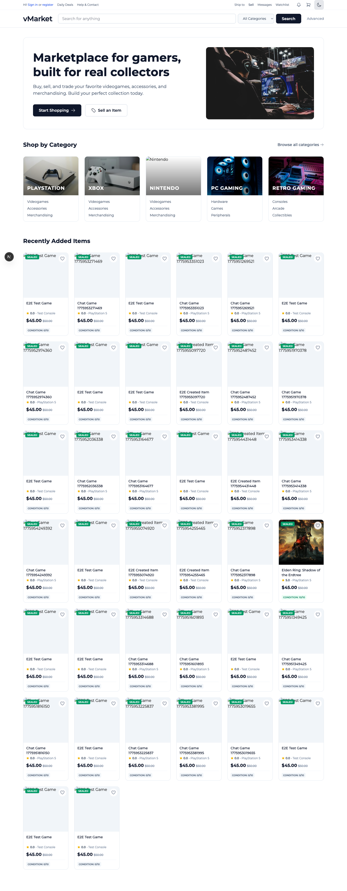
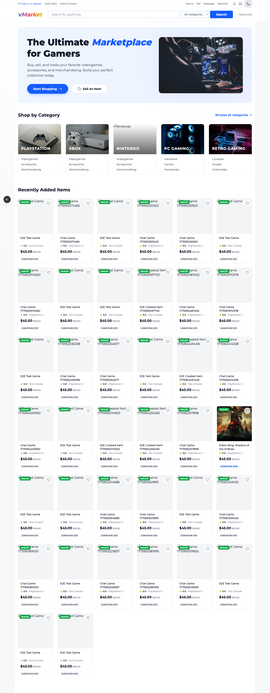

# vMarket: Fullstack Hexagonal Marketplace

vMarket is a robust, scalable, and production-ready full-stack application built with a **Dual-Hexagonal Architecture**. It combines a high-performance .NET 10 backend with a modern Next.js 15 frontend, focusing on maintainability, testability, and a premium user experience.



## 🏗 Architecture

This project implements **Hexagonal Architecture** (Ports and Adapters) on both the backend and frontend to ensure strict separation of concerns and business logic independence.

### Backend (.NET)
- **Domain Layer**: Pure logic, entities (Videogames, Users), and domain services.
- **Application Layer**: Use cases, DTOs, and Ports (Interfaces).
- **Infrastructure Layer**: Persistence (PostgreSQL + EF Core), Auth (BCrypt), and Adapters.
- **API Layer**: ASP.NET Core controllers and DI configuration.

### Frontend (Next.js)
- **Domain**: Models and interface definitions for business logic.
- **Infrastructure**: API services (Axios) and storage adapters.
- **Presentation**: React components and Next.js App Router pages.
- **Context/State**: Clean state management via React Context.

## ✨ Features

- **Full Marketplace Flow**: Browse videogames by categories with an eBay-inspired design.
- **User Authentication**: Secure registration and login with JWT and BCrypt hashing.
- **Progressive Registration Email Verification**:
   - New optional verification step after signup: send 6-digit code by email and confirm on a dedicated page.
   - Implemented in baby-step mode to avoid breaking current flow: account creation/login still works even if email verification is pending.
- **Inventory Management**: Sell and list items with detailed forms (pricing, condition, categories).
- **Image Upload System**: 
  - Multiple cover images with drag-and-drop reordering
  - Individual uploads for 6 product sides (Front, Back, Right, Left, Top, Bottom)
  - **Secure Presigned URLs** for direct, high-performance image access
  - Real-time preview thumbnails
  - MinIO/S3-compatible storage integration
- **Robust Cover Fallback System**:
  - `VideogameCover` component with a three-tier priority chain: uploaded images → `urlImg` → text-based placeholder
  - State keying pattern — zero `useEffect` / mounted-ref overhead; fallback chain self-resets synchronously in render when the product changes
  - Auto-fetch official cover from RAWG API at listing creation time if no images are provided
  - Utility helpers `resolveVideogameImageSrc` and `getVideogameImageCandidates` for reuse across the app
- **Frontend Asset Hardening**:
   - Critical UI icons migrated from Material Symbols font ligatures to bundled Heroicons SVGs
   - Homepage and login marketing assets now resolve through `NEXT_PUBLIC_IMAGE_BASE_URL` when configured, with automatic fallback to local files under `Videogames.Web/public/assets`
   - Removes runtime dependence on external font/CDN availability while still allowing S3-hosted frontend assets in deployed environments
- **Social Login Scaffolding** (Google & Apple): OAuth flow wired end-to-end; UI buttons disabled until provider credentials are configured (`FEATURE-PENDING`)
- **Dual-Hexagonal Pattern**: Decoupled layers for maximum testability.
- **Responsive Design**: Premium UI with Dark Mode support and micro-animations.
- **Clean CI/CD**: Automated GitHub Actions pipeline for backend and frontend with E2E tests.

## 🛠 Tech Stack

### Backend
- **Framework**: .NET 10.0
- **Database**: PostgreSQL 17
- **ORM**: Entity Framework Core 10.0
- **Security**: 
  - JWT Authentication (Microsoft.AspNetCore.Authentication.JwtBearer 10.0.0)
  - BCrypt.Net-Next 4.0.3
- **Storage**: MinIO (S3-compatible) via AWSSDK.S3 3.7.407
- **Logging**: Serilog.AspNetCore 9.0.0
- **Testing**: xUnit 2.9.2, Moq 4.20.72
- **API Documentation**: Swashbuckle.AspNetCore 6.6.2

### Frontend
- **Framework**: Next.js 16.1.0 (App Router)
- **Runtime**: React 19.2.0
- **Language**: TypeScript 5.x
- **Styling**: Tailwind CSS 4.x (Vanilla CSS with modern patterns)
- **Icons**: Heroicons 2.2.0, Iconoir React 7.11.0
- **API Client**: Axios 1.13.2 with interceptors
- **E2E Testing**: Playwright 1.57.0

### Infrastructure
- **Containerization**: Docker & Docker Compose
- **CI/CD**: GitHub Actions
- **Node.js**: 20.x
- **Package Manager**: npm

## 🚀 Getting Started

### Prerequisites
- [.NET SDK 10.0+](https://dotnet.microsoft.com/download)
- [Node.js 20+](https://nodejs.org/)
- [Docker](https://www.docker.com/) (for PostgreSQL)

### Setup

1. **Clone the repository**
   ```bash
   git clone https://github.com/Alountk/vMarket.git
   cd vMarket
   ```

2. **Start Infrastructure (PostgreSQL)**
   ```bash
   docker-compose up -d
   ```

3. **Backend Setup**
   ```bash
   # Run migrations
   cd Videogames.Infrastructure
   dotnet ef database update -s ../Videogames.API
   
   # Run API
   cd ../Videogames.API
   dotnet run
   ```
   The API will be available at `http://localhost:5017`.

4. **Frontend Setup**
   ```bash
   cd Videogames.Web
   npm install
   npm run dev
   ```
   The Marketplace will be available at `http://localhost:3000`.

## 🧪 Testing

### Backend
```bash
dotnet test
```

### Frontend E2E
```bash
cd Videogames.Web
npx playwright install
npm run test:e2e
```

## 🚀 Versioned Docker Deploy

Deployments can be pinned to an immutable image version generated in CI on every push to `main`.

Important: use `docker-compose.deploy.yml` in Portainer or remote deployments. The root `docker-compose.yml` is for local builds and uses local image names, so a remote engine may try to inspect `docker.io/library/...` and fail.

If you use Arcane or any GitOps-style stack sync that reacts immediately to git changes, prefer the CI-managed stack file `deploy/arcane-stack.yml`. It is rewritten only after the Docker release workflow has already pushed the immutable image tags to GHCR.

1. Set deployment variables (based on `.env.portainer.example`):
```bash
APP_VERSION=main-<runNumber>-<shortSha>
API_IMAGE_REPO=ghcr.io/<owner>/vmarket-api
WEB_IMAGE_REPO=ghcr.io/<owner>/vmarket-web
```

2. Use the exact CI tag published by the `Docker Release (Main)` workflow:
```bash
APP_VERSION=main-<runNumber>-<shortSha>
```

3. Deploy exact versions:
```bash
docker compose -f docker-compose.deploy.yml up -d
```

4. `docker-compose.deploy.yml` now sets `pull_policy: always`, so remote stacks re-check GHCR even if a tag already exists locally.

5. If the GHCR packages are private, configure Portainer/Arcane with registry credentials for `ghcr.io` before deploying.

6. Rollback to a previous release by changing only `APP_VERSION` and re-running deploy.

7. Avoid `APP_VERSION=main-latest` in GitOps-style auto-deploy flows. If the stack update is triggered by the git push itself, the deploy can happen before CI finishes publishing the new image, which leaves the environment one release behind.

Helper make targets:
```bash
make docker-deploy-up
make docker-deploy-down
```

### Arcane / GitOps Exact Version Flow

For Arcane, point the stack to `deploy/arcane-stack.yml` instead of `docker-compose.deploy.yml`.

How it works:
- A push to `main` triggers `.github/workflows/docker-release.yml`.
- CI builds and pushes the API and Web images with an immutable tag `main-<runNumber>-<shortSha>`.
- After the push succeeds, CI rewrites `deploy/arcane-stack.yml` and `deploy/release.json` with those exact tags.
- CI commits those release files back to `main`.
- Arcane then deploys the commit that already contains the pinned image tags, avoiding the race where a stack update happens before `main-latest` is refreshed.

Notes:
- `deploy/arcane-stack.yml` still keeps runtime secrets and ports as environment variables, so you can continue configuring them in Arcane/Portainer.
- The workflow ignores commits that only update `deploy/arcane-stack.yml` and `deploy/release.json`, so this release-manifest commit does not loop forever.
- `deploy/release.json` is only a small observable manifest for humans/tools; Arcane should deploy `deploy/arcane-stack.yml`.
- For frontend API and marketing assets in production builds, define repository variables `NEXT_PUBLIC_API_URL` and `NEXT_PUBLIC_IMAGE_BASE_URL` in GitHub Actions settings. These values are injected at web image build-time.

## 📂 Project Structure

```
├── Videogames.API             # .NET REST entry point
├── Videogames.Application     # Backend Use Cases & Ports
├── Videogames.Domain          # Backend Entities & Domain Logic
├── Videogames.Infrastructure  # DB, Migrations, Auth Implementations
├── Videogames.Web             # Next.js 15 Frontend
│   ├── src/app                # App Router (Pages)
│   ├── src/components         # UI Components
│   ├── public/assets          # Local category and UI image assets
│   ├── src/context            # Auth & State Contexts
│   ├── src/domain             # Frontend Models & Ports
│   ├── src/infrastructure     # API Services & Axios Setup
│   └── tests/                 # Playwright E2E Tests
└── .github/workflows          # CI/CD (GitHub Actions)
```

## 🎨 UI Redesign Snapshot

### Before



### After


## 🗺 Roadmap

- [x] **Full-stack Foundation** (Next.js + .NET)
- [x] **Authentication System** (JWT + BCrypt)
- [x] **Marketplace Discovery** (Home + Categories)
- [x] **Sell Item Flow** (Forms + API integration)
- [x] **CI/CD Pipeline** (Automated Linters + Tests)
- [x] **Image Upload System**: MinIO/S3 integration with multi-image support and drag-to-reorder
- [x] **Cover Fallback System**: `VideogameCover` component + RAWG API auto-fetch + text placeholder
- [x] **Social Login Scaffolding**: Google & Apple OAuth flow wired; buttons gated behind `FEATURE-PENDING`
- [x] **Registration Verification Baby Step 1**: Send 6-digit code on signup + confirmation page (`/register/confirm`) without blocking the existing auth flow.
- [x] **Registration Verification Baby Step 2**: Persist verification status and enforce confirmation on sensitive actions.
- [x] **Registration Verification Baby Step 3**: Enforce email verification on sensitive actions (create listing, initiate chat).
- [ ] **Messaging System (Next)**: Real-time chat between buyers and sellers.
- [ ] **Production Image Recovery**: Recover lost uploaded images in production and harden storage retention/backup safeguards.
- [ ] **Social Login Activation (Deferred)**: Enable Google / Apple providers once credentials are registered in each OAuth console
- [ ] **Advanced Filtering**: Full-text search and faceted navigation.
- [ ] **Payment Integration**: Stripe or PayPal checkout.

## 🤝 Contributing

Contributions are welcome! Please feel free to submit a Pull Request.

## 📄 License

This project is licensed under the MIT License.

## 📝 Postmortem & Improvements

### Production Image Recovery Plan
- **Audit Scope**:
   - Enumerate all image file names currently referenced by videogames in production data.
   - Compare referenced file names against objects that still exist in the production bucket.
   - Produce three buckets: `healthy`, `missing-but-recoverable`, `missing-without-source`.
- **Recovery Actions**:
   - Restore recoverable objects from backups, bucket versioning, or deployment artifacts.
   - Rehydrate missing derived URLs/metadata after object restore so read access works again.
   - Mark unrecoverable images for manual remediation and expose a controlled admin/export report.
- **Hardening Actions**:
   - Enable or verify bucket versioning and retention/lifecycle settings for upload paths.
   - Add periodic integrity checks that detect DB references pointing to missing objects.
   - Add an operational backup/restore runbook for images separate from database restore steps.
- **Validation Exit Criteria**:
   - Zero production videogames referencing missing image objects.
   - Verified restore drill for at least one deleted object.
   - Monitoring/alerting in place for future object-reference drift.

### Image Recovery Audit Script
Use the CLI tool in `tools/ImageRecoveryAudit` to run one or both audits:
- `storage`: compare referenced image keys in PostgreSQL against objects currently stored in MinIO/S3.
- `frontend-assets`: compare static `/assets/...` references in frontend source code against files present under `Videogames.Web/public/assets`.
- `all` (default): run both audits.

Audit mode:
- `AUDIT_MODE` (`all`, `storage`, `frontend-assets`; default: `all`)

Required environment variables:
- For `storage` / `all`:
   - `AUDIT_DB_CONNECTION_STRING`
   - `AUDIT_MINIO_ENDPOINT`
   - `AUDIT_MINIO_USER`
   - `AUDIT_MINIO_SECRET`
   - `AUDIT_MINIO_BUCKET`

Optional environment variables:
- `AUDIT_MINIO_REGION` (default: `us-east-1`; `storage` / `all` only)

### Frontend Asset Base URL Postmortem
- **Incident**:
   - The homepage hero and homepage category cards were using hardcoded `/assets/...` paths instead of the same environment-driven resolution used by uploaded product images.
   - In environments where frontend assets are expected to load from S3 via `NEXT_PUBLIC_IMAGE_BASE_URL`, those homepage assets stayed on local paths and never switched to the remote origin.
- **Root Cause**:
   - Asset URL resolution logic existed for uploaded videogame images in `Videogames.Web/src/utils/videogameImages.ts`, but static marketing assets were bypassing that path entirely.
   - The regression was architectural rather than infrastructural: the app had two separate conventions for image URLs.
- **Fix Applied**:
   - Added a shared `resolveFrontendAssetSrc()` helper alongside the existing videogame image resolver.
   - Updated homepage hero, homepage category cards, and login background to use the shared resolver.
   - Preserved local `/assets/...` fallback behavior when `NEXT_PUBLIC_IMAGE_BASE_URL` is unset so local development and non-S3 deployments continue to work.
- **Prevention**:
   - Treat frontend marketing assets and uploaded images as separate categories, but require both to go through explicit URL resolvers.
   - Avoid introducing new hardcoded `/assets/...` paths directly inside page components when the deployment model supports remote asset hosting.
   - Keep the `frontend-assets` audit as a guardrail for missing files, but not as a substitute for runtime URL resolution review.

### Recover Missing Images To MinIO/S3
Use the same CLI tool in `tools/ImageRecoveryAudit` with mode `recover` to upload missing object keys from a local source directory.

Required environment variables:
- `AUDIT_MODE=recover`
- `AUDIT_MINIO_ENDPOINT`
- `AUDIT_MINIO_USER`
- `AUDIT_MINIO_SECRET`
- `AUDIT_MINIO_BUCKET`
- `AUDIT_RECOVERY_SOURCE_DIR` (base folder where source images exist)

Optional environment variables:
- `AUDIT_MINIO_REGION` (default: `us-east-1`)
- `AUDIT_MINIO_USE_SSL` (`true`/`false`)
- `AUDIT_RECOVERY_MISSING_CSV` (default: `./audit-output/missing-image-references.csv`)
- `AUDIT_RECOVERY_APPLY=true` to perform uploads. If omitted, it runs as dry-run.
- `AUDIT_OUTPUT_DIR` (default: `./audit-output`)

Example:
```bash
# 1) Run storage audit and generate missing-image-references.csv
AUDIT_MODE=storage dotnet run --project tools/ImageRecoveryAudit/ImageRecoveryAudit.csproj

# 2) Dry-run recovery (no uploads)
AUDIT_MODE=recover \
AUDIT_MINIO_ENDPOINT=localhost:9000 \
AUDIT_MINIO_USER=minioadmin \
AUDIT_MINIO_SECRET=minioadmin \
AUDIT_MINIO_BUCKET=videogames \
AUDIT_RECOVERY_SOURCE_DIR=/path/to/recovered-images \
dotnet run --project tools/ImageRecoveryAudit/ImageRecoveryAudit.csproj

# 3) Apply recovery uploads
AUDIT_MODE=recover \
AUDIT_RECOVERY_APPLY=true \
AUDIT_MINIO_ENDPOINT=localhost:9000 \
AUDIT_MINIO_USER=minioadmin \
AUDIT_MINIO_SECRET=minioadmin \
AUDIT_MINIO_BUCKET=videogames \
AUDIT_RECOVERY_SOURCE_DIR=/path/to/recovered-images \
dotnet run --project tools/ImageRecoveryAudit/ImageRecoveryAudit.csproj
```

### Migrate External Image URLs To MinIO/S3
Use mode `migrate-external` to migrate image references that currently store full external URLs (for example RAWG) into internal object keys stored in MinIO/S3, and update database references.

Required environment variables:
- `AUDIT_MODE=migrate-external`
- `AUDIT_DB_CONNECTION_STRING`
- `AUDIT_MINIO_ENDPOINT`
- `AUDIT_MINIO_USER`
- `AUDIT_MINIO_SECRET`
- `AUDIT_MINIO_BUCKET`

Optional environment variables:
- `AUDIT_MINIO_REGION` (default: `us-east-1`)
- `AUDIT_MINIO_USE_SSL` (`true`/`false`)
- `AUDIT_EXTERNAL_KEY_PREFIX` (default: `external`)
- `AUDIT_EXTERNAL_ALLOWED_HOSTS` (comma-separated host allow-list; empty means all hosts)
- `AUDIT_EXTERNAL_MIGRATION_APPLY=true` to execute uploads and DB updates. If omitted, it runs as dry-run.
- `AUDIT_OUTPUT_DIR` (default: `./audit-output`)

Example:
```bash
# Dry-run (plan only, no upload, no DB update)
AUDIT_MODE=migrate-external \
AUDIT_DB_CONNECTION_STRING='Server=localhost;Port=5432;Database=videogamesdb;User Id=videogames;Password=secret;' \
AUDIT_MINIO_ENDPOINT=localhost:9000 \
AUDIT_MINIO_USER=minioadmin \
AUDIT_MINIO_SECRET=minioadmin \
AUDIT_MINIO_BUCKET=videogames \
AUDIT_EXTERNAL_ALLOWED_HOSTS=media.rawg.io \
dotnet run --project tools/ImageRecoveryAudit/ImageRecoveryAudit.csproj

# Apply (upload + DB update)
AUDIT_MODE=migrate-external \
AUDIT_EXTERNAL_MIGRATION_APPLY=true \
AUDIT_DB_CONNECTION_STRING='Server=localhost;Port=5432;Database=videogamesdb;User Id=videogames;Password=secret;' \
AUDIT_MINIO_ENDPOINT=localhost:9000 \
AUDIT_MINIO_USER=minioadmin \
AUDIT_MINIO_SECRET=minioadmin \
AUDIT_MINIO_BUCKET=videogames \
AUDIT_EXTERNAL_ALLOWED_HOSTS=media.rawg.io \
dotnet run --project tools/ImageRecoveryAudit/ImageRecoveryAudit.csproj
```

### Sync Frontend Assets Folder To MinIO/S3
Use mode `sync-frontend-assets` to upload files from `Videogames.Web/public/assets` to MinIO/S3.

Required environment variables:
- `AUDIT_MODE=sync-frontend-assets`
- `AUDIT_MINIO_ENDPOINT`
- `AUDIT_MINIO_USER`
- `AUDIT_MINIO_SECRET`
- `AUDIT_MINIO_BUCKET`

Optional environment variables:
- `AUDIT_MINIO_REGION` (default: `us-east-1`)
- `AUDIT_MINIO_USE_SSL` (`true`/`false`)
- `AUDIT_FRONTEND_PUBLIC_DIR` (default: `./Videogames.Web/public`)
- `AUDIT_ASSETS_SYNC_PREFIX` (example: `static`, empty by default)
- `AUDIT_ASSETS_SYNC_APPLY=true` to execute uploads. If omitted, it runs as dry-run.
- `AUDIT_OUTPUT_DIR` (default: `./audit-output`)

Example:
```bash
# Dry-run
AUDIT_MODE=sync-frontend-assets \
AUDIT_MINIO_ENDPOINT=localhost:9000 \
AUDIT_MINIO_USER=minioadmin \
AUDIT_MINIO_SECRET=minioadmin \
AUDIT_MINIO_BUCKET=videogames \
dotnet run --project tools/ImageRecoveryAudit/ImageRecoveryAudit.csproj

# Apply
AUDIT_MODE=sync-frontend-assets \
AUDIT_ASSETS_SYNC_APPLY=true \
AUDIT_MINIO_ENDPOINT=localhost:9000 \
AUDIT_MINIO_USER=minioadmin \
AUDIT_MINIO_SECRET=minioadmin \
AUDIT_MINIO_BUCKET=videogames \
dotnet run --project tools/ImageRecoveryAudit/ImageRecoveryAudit.csproj
```
- `AUDIT_MINIO_USE_SSL` (default: `false`; `storage` / `all` only)
- `AUDIT_OUTPUT_DIR` (default: `./audit-output`)
- `AUDIT_FRONTEND_PUBLIC_DIR` (default: `./Videogames.Web/public`; `frontend-assets` / `all` only)
- `AUDIT_FRONTEND_SOURCE_DIR` (default: `./Videogames.Web/src`; `frontend-assets` / `all` only)

Run:
```bash
make audit-images
```

Outputs:
- `image-recovery-audit.json` (storage summary + missing references + impacted videogames/fields)
- `missing-image-references.csv` (storage flat report for operations/manual remediation)
- `frontend-assets-audit.json` (frontend summary + missing/unused assets)
- `missing-frontend-assets.csv` (frontend missing assets with file and line usage)
- `unused-frontend-assets.csv` (frontend assets present on disk but not referenced in source)

### 2026-05-09: Presigned Read URL Refresh, Naming Cleanup & E2E Expansion
- **Backend Metadata Endpoint**: Added `GET /api/Images/{fileName}/metadata` to return a short-lived read access URL plus expiration metadata. This enables frontend refresh-on-failure without relying on a full redirect request cycle.
- **Legacy Upload Deprecation Signal**: Added explicit warning logs whenever `POST /api/Images/upload` (legacy multipart) is used, making rollout telemetry visible while preserving backward compatibility.
- **Read URL Expiration Strategy**:
   - Backend now generates read presigned URLs with explicit TTL through service/port abstractions.
   - Frontend caches `fileName -> accessUrl + expiresAtUtc` in session storage and resolves from cache first when valid.
   - On image load failure, frontend attempts a one-time metadata refresh and retries automatically before showing fallback.
- **Reusable Frontend Component**: Introduced `RefreshableImage` and applied it to product side thumbnails, create upload previews, and advanced box-art previews to avoid duplicated refresh logic.
- **Naming & Cleanup**:
   - Renamed ambiguous state holders (for example in cover/image components) to descriptive names.
   - Standardized test variable naming for request counters and stabilized ordering-sensitive tests with serial mode where needed.
- **E2E Coverage Added/Updated**:
   - Existing fallback test validated after refactor (`presigned -> legacy multipart`).
   - New E2E scenario validates refresh flow: initial access URL fails, metadata is requested again, fresh URL is used successfully.
- **Validation Status**:
   - Backend targeted tests (ImageService + ImagesController) passing.
   - Playwright fallback/refresh suite passing for the updated spec.

### 2026-05-13: Registration Email Verification (Baby Step 1)
- **Goal**: Introduce email verification during signup without breaking the current login/register behavior.
- **Backend Additions**:
   - Added `POST /api/Auth/register-email/send-code` to issue and send a 6-digit verification code.
   - Added `POST /api/Auth/register-email/confirm` to validate submitted code.
   - Verification codes are short-lived and kept in memory cache (10-minute TTL) for this first rollout.
   - SMTP-based sender added with safe fallback: if SMTP is not configured, API logs a warning and keeps the flow non-blocking.
- **Frontend Additions**:
   - Registration now triggers code send (best effort) and redirects to `/register/confirm?email=...`.
   - New confirmation page supports code entry, verification, and resend.
   - Existing auth flow remains functional; users are not hard-blocked in this step.
- **Baby Step Rollout Plan**:
   - Step 1 (current): issue/confirm codes with non-blocking UX.
   - Step 2: persist `email verified` status in DB and expose it in auth payload.
   - Step 3: progressively enforce verification in guarded actions/routes.
   - Step 4: harden operations (rate limiting, retries, observability, and provider-backed transactional email).

### 2026-05-13 (continued): Registration Email Verification (Baby Step 2)
- **Goal**: Persist email verified status in DB and return it in auth responses for progressive enforcement.
- **Database Changes**:
   - Added `EmailVerified` boolean column to `User` table (default: `false`).
   - Migration: `AddEmailVerifiedToUser` applied.
- **Backend Updates**:
   - Added `Task MarkEmailAsVerifiedAsync(string email)` to `IUserService` + implementation.
   - `POST /api/Auth/register-email/confirm` now calls `MarkEmailAsVerifiedAsync` after successful code validation.
   - `UserDto` now includes `EmailVerified` field returned in all auth responses.
- **Frontend Updates**:
   - `User` model now includes `emailVerified: boolean` for UI-level checks.
   - Confirmation page shows clear success state upon email verification.
   - AuthContext stores verified status from payload.
- **Status**:
   - Both backend and frontend build successfully.
   - No breaking changes; existing flows unaffected.
- **Next Step (Baby Step 3)**: Enforce email verification gating on sensitive actions (sell item, send message, etc.).

### 2026-05-13 (continued): Registration Email Verification (Baby Step 3)
- **Goal**: Enforce email verification on sensitive user actions (create listing, initiate messages) while maintaining progressive UX.
- **Backend Enforcement**:
   - Updated `TokenService.GenerateToken()` to include `email_verified` claim in JWT tokens with user's current verification status.
   - Created `RequireEmailVerifiedAttribute`: custom IAsyncAuthorizationFilter that returns 403 Forbidden if `email_verified` claim is false/missing.
   - Applied `[RequireEmailVerified]` to:
     - `VideogamesController.Create`: Prevents unverified users from publishing new listings.
     - `ChatController.StartConversation`: Prevents unverified users from initiating buyer-seller conversations.
   - Enforcement is non-blocking at submission level: users see UI warnings and backend returns 403 if they bypass frontend checks.
- **Frontend UX Improvements**:
   - Added warning banner on `/create` page (non-blocking): alerts unverified users that email verification is required to publish.
   - Added warning banner on `/messages` page (non-blocking): alerts unverified users that email verification is required to send messages.
   - Banners only show when `user.emailVerified === false`.
   - Users can still complete forms; backend enforces the gate on submission.
- **Rollout & Progressive Enhancement**:
   - Users who have already verified their email are unaffected (claim always reflects current status).
   - New users see warnings but can proceed to fill forms; backend gracefully rejects unverified submissions with 403.
   - Error handling on frontend can later be added to show modal/redirect to verification on 403 responses.
- **Status**:
   - ✅ Both API and Web build cleanly.
   - ✅ All three baby steps (send code → persist status → enforce on actions) successfully shipped.
   - Next Phase: Additional protected endpoints, rate limiting, transactional email hardening, and observability.

### 2026-04-21: Presigned Upload Rollout (Phase 1) + API Coverage
- **Presigned Upload Endpoint**: Added `POST /api/Images/presigned-upload` for private, short-lived upload URLs in the Images API flow.
- **Safe Fallback Kept**: Frontend upload now tries presigned first and automatically falls back to legacy multipart `POST /api/Images/upload` if unavailable/failing, preserving compatibility during rollout.
- **Input Hardening**: Added server/client-side constraints for image upload flow (allowed MIME set and max file size policy in create flow).
- **Create Flow Resilience**: Replaced all-or-nothing upload behavior with partial success handling (`Promise.allSettled`) so one failed image no longer blocks the whole batch.
- **API Test Coverage Added**: New controller tests for `ImagesController` now cover:
   - valid `presigned-upload` request (`200`),
   - validation/service argument failures (`400`),
   - legacy upload size guard (`400`),
   - legacy successful upload response (`200`),
   - image retrieval redirect behavior.
- **Regression Status**: Backend suite remains green after this phase (`44/44` tests passing).

### 2026-04-15: Social Login Gating & Cover Fallback System (PR #15, PR #16)
- **Social Login Buttons Disabled**: Removed `useGoogleLogin`, `loginWithApple`, and `oauthLoading` from `login/page.tsx` and `register/page.tsx`. Buttons rendered as `disabled` / `FEATURE-PENDING`. Underlying OAuth service and token exchange logic are intact—re-enabling requires only restoring the handlers once provider credentials exist.
- **`VideogameCover` Component**: New component with a three-tier priority chain — uploaded images → `urlImg` → text-based placeholder. Renders the first non-errored source; on full exhaustion shows a styled block with the game title that adapts to any container.
- **State Keying Pattern**: Initial `VideogameCover` implementation used a `hasComponentMounted` ref + `useEffect` to reset fallback state on product change. Identified as a cascading-render anti-pattern and replaced with a state object keyed by `candidatesKey` (join of all candidate URLs): state resets synchronously in render with zero effects or refs.
- **RAWG Auto-Fetch at Creation**: `create/page.tsx` queries the RAWG API at submit time if no images are provided, storing an official cover URL in `urlImg`. Keeps catalogue visually consistent without requiring seller effort.
- **Tailwind v4 Migration Note**: Linter flagged `[overflow-wrap:anywhere]` (arbitrary CSS escape). Replaced with the first-class utility `wrap-anywhere`.

### 2026-04-16: Icon Reliability & Local Category Assets
- **Heroicons Migration for Critical UI**: Replaced remaining `material-symbols-outlined` usages in navbar, login, register, home, and create flows with bundled Heroicons SVG components. This removes dependency on the Google Material Symbols stylesheet for critical navigation and form affordances.
- **Local Category Images**: Moved marketplace category card images off remote Unsplash URLs into local assets under `Videogames.Web/public/assets/categories`, preventing CDN failures and 404s from breaking the homepage category grid.
- **Recovery Detail**: One Nintendo image URL had already started returning `404`; the recovery standardized all category imagery behind local static paths so a single external outage cannot degrade the marketplace UI again.

### 2026-04-12: Frontend Release Failure in Docker CI (Next 16)
- **Incident**: `docker-release.yml` failed in `Build and push Web image` with `npm run build` exit code `1`, blocking frontend image publication.
- **Root Cause**: The `/messages` route used `useSearchParams()` without a `Suspense` boundary, which fails Next.js 16 production prerendering.
- **Fix Applied**: Refactored the page into `MessagesPageContent` and wrapped the exported page with `<Suspense fallback=...>` in `src/app/messages/page.tsx`.
- **Validation**: Re-ran `npm run build` in `Videogames.Web`; build now completes and `/messages` is generated successfully.
- **Improvements**:
   - Add a mandatory frontend production build check before pushing release-related commits.
   - Keep hooks that depend on URL search params isolated in client-only content wrapped by `Suspense`.
   - Treat CI annotation-only errors (`buildx ... npm run build`) as actionable by reproducing with local `next build` immediately.

### 2026-04-12: Test Stabilization, Dependency Cleanup & Item Creation Coverage
- **Backend Resilience**: Hardened `UserService.CreateAsync` to safely handle unexpected `null` returns from repository create operations, preventing `NullReferenceException` during auth response mapping.
- **E2E Stability**: Stabilized Playwright tests for marketplace, RAWG search, and chat flows by improving selectors, replacing brittle expectations, and making image fixture handling deterministic.
- **Test Architecture**: Refactored Playwright tests with shared support helpers (`tests/support/auth.ts`, `tests/support/item-creation.ts`) to reduce duplication and improve maintainability.
- **Naming Consistency**: Standardized test naming conventions by renaming `rawg_search.spec.ts` to `rawg-search.spec.ts` and syncing project documentation.
- **New Coverage**: Added a new test in the existing marketplace suite where a registered user creates an item and verifies it appears in listings.
- **Build Health**: Removed redundant package references in `Videogames.Infrastructure.csproj` (`Microsoft.Extensions.Configuration.Binder`, `Microsoft.Extensions.DependencyInjection.Abstractions`, `Microsoft.Extensions.Http`) that were already provided by `Microsoft.AspNetCore.App`, eliminating `NU1510` warnings.

### 2026-04-11: RAWG API Integration & Hydration Fixes
- **Feature**: Integrated **RAWG API** to automatically fetch game metadata (name, release date, description, score, platform) during the "Sell Item" flow. Implemented a debounced search UI to improve UX and reduce API calls.
- **Bug Fix**: Resolved **hydration mismatch** errors in `AuthContext` and `ThemeToggle`. Moved client-side state initialization (from `localStorage` and `window`) into `useEffect` hooks to ensure consistency between server-rendered HTML and client-side hydration.
- **UX**: Added a loading skeleton to the `Navbar` to handle asynchronous auth state determination, preventing content flickering during page load.

### 2026-04-11: Registration API Alignment & DB Diagnostics
- **Bug Fix**: Fixed a mismatch between the Frontend and Backend registration flow. The `UsersController.Create` now returns an `AuthResponseDto` (Token + User), allowing immediate auto-login after a successful registration.
- **Diagnostics**: Added a high-visibility Console Warning when the application fails to find a valid connection string, preventing silent fallbacks to In-Memory mode that could confuse developers.
- **Configuration**: Added `appsettings.Development.json` to the API to provide clear guidance on where to configure local database connections.

### 2026-04-11: Comprehensive Test Suite & QA
- **E2E Testing**: Created `registration.spec.ts` to verify the full registration UI flow, ensuring immediate auto-login and handling edge cases like duplicate emails.
- **API Testing**: Created `rawg-search.spec.ts` with comprehensive API mocking to test the RAWG integration (search, auto-fill, and error handling) without external dependencies.
- **Backend Stability**: Updated `UserServiceTests.cs` to align with the new authentication response format and verified token generation logic.
- **QA**: Integrated hydration checks within the E2E suite to monitor for React hydration mismatches during navigation.


